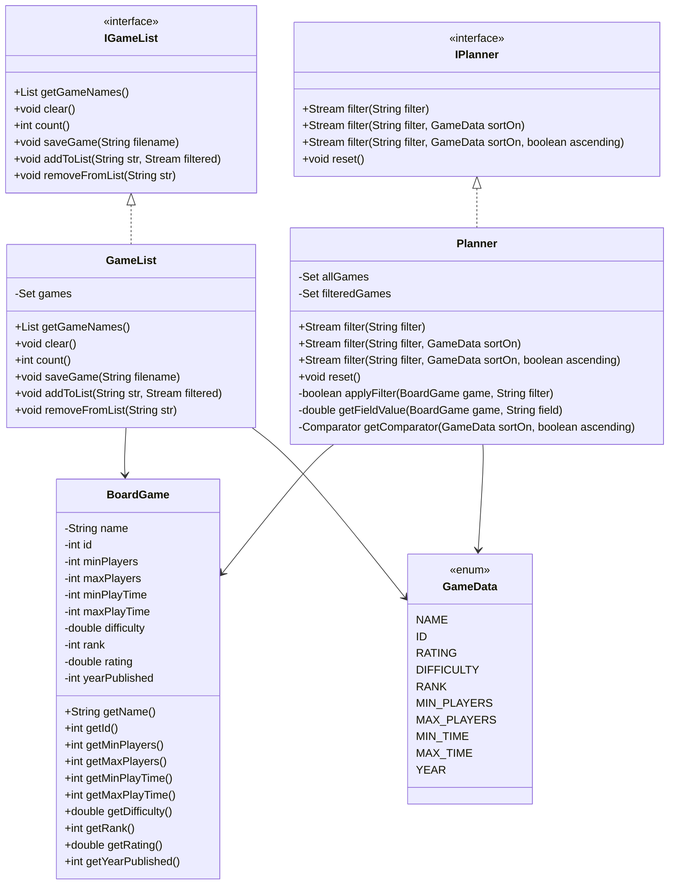
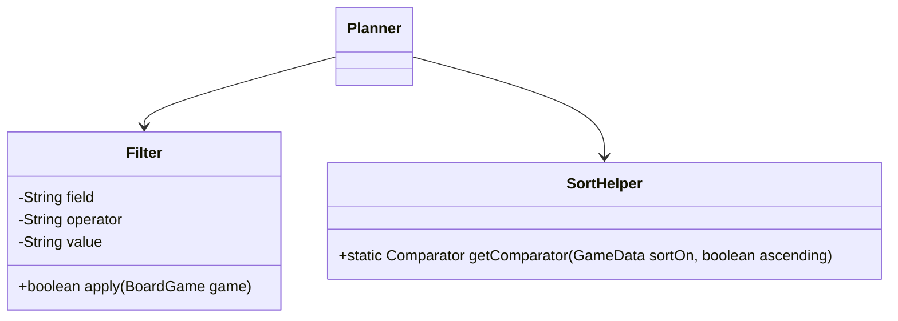
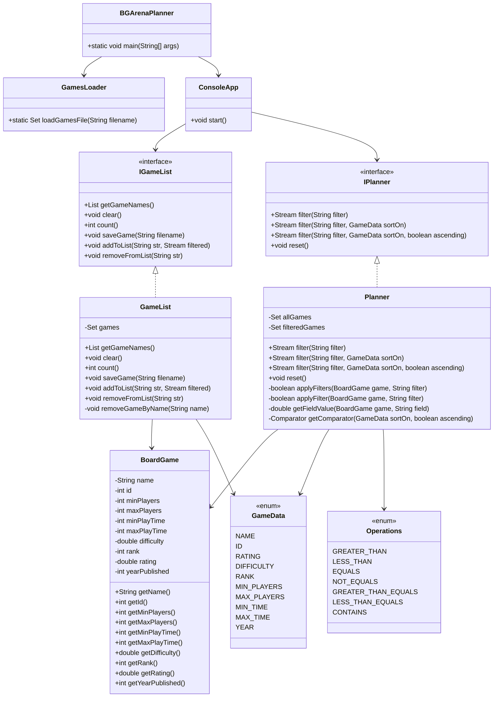

# Board Game Arena Planner Design Document

This document is meant to provide a tool for you to demonstrate the design process. You need to work on this before you code, and after have a finished product. That way you can compare the changes, and changes in design are normal as you work through a project. It is contrary to popular belief, but we are not perfect our first attempt. We need to iterate on our designs to make them better. This document is a tool to help you do that.

## (INITIAL DESIGN): Class Diagram 

Place your class diagrams below. Make sure you check the file in the browser on github.com to make sure it is rendering correctly. If it is not, you will need to fix it. As a reminder, here is a link to tools that can help you create a class diagram: [Class Resources: Class Design Tools](https://github.com/CS5004-khoury-lionelle/Resources?tab=readme-ov-file#uml-design-tools)

### Provided Code

Provide a class diagram for the provided code as you read through it.  For the classes you are adding, you will create them as a separate diagram, so for now, you can just point towards the interfaces for the provided code diagram.

### Your Plans/Design

Create a class diagram for the classes you plan to create. This is your initial design, and it is okay if it changes. Your starting points are the interfaces. 

## (INITIAL DESIGN): Tests to Write - Brainstorm

Write a test (in english) that you can picture for the class diagram you have created. This is the brainstorming stage in the TDD process. 

> [!TIP]
> As a reminder, this is the TDD process we are following:
> 1. Figure out a number of tests by brainstorming (this step)
> 2. Write **one** test
> 3. Write **just enough** code to make that test pass
> 4. Refactor/update  as you go along
> 5. Repeat steps 2-4 until you have all the tests passing/fully built program

You should feel free to number your brainstorm. 

1. Test 1..
2. Test 2..

### GameList Tests

1. `Test getGameNames()` - Add multiple board games to GameList. Call getGameNames() and check if the returned list contains the names in alphabetical order.
2. `Test clear()` - Add several games to GameList. Call clear(). Check if the game count is 0.
3. `Test count()` - Add a few board games. Call count() and verify the correct number of games is returned.
4. `Test saveGame()` - Add some board games. Call saveGame("filename.txt"). Read the file and verify that it contains the correct game names.
5. `Test addToList() with "all"` - Call addToList("all", gamesStream). Verify all games are added to GameList.
6. `Test addToList() with specific game name` - Call addToList("Chess", gamesStream). Verify only "Chess" is added.
7. `Test removeFromList() by name` - Add games to GameList. Call removeFromList("Chess").Verify "Chess" is removed.

### Planner Tests

1. `Test filter() by name equals` - Call filter("name == Chess"). Verify only "Chess" is returned.
2. `Test filter() by rating greater than` - Call filter("rating > 4.5").Verify only games with a rating greater than 4.5 are returned.
3. `Test filter() by player range` - Call filter("minPlayers >= 2, maxPlayers <= 4"). Verify only games that allow 2-4 players are returned.
4. `Test sorting by rating descending` - Call filter("all", GameData.RATING, false).Verify games are sorted in descending order by rating.
5. `Test sorting by year ascending` - Call filter("all", GameData.YEAR, true).Verify games are sorted in ascending order by year.
6. `Test filtering with an invalid field` - Call filter("unknownField == 10"). Verify that IllegalArgumentException is thrown.
7. `Test empty filter` - Call filter(""). Verify that all games are returned.

## (FINAL DESIGN): Class Diagram

Go through your completed code, and update your class diagram to reflect the final design. Make sure you check the file in the browser on github.com to make sure it is rendering correctly. It is normal that the two diagrams don't match! Rarely (though possible) is your initial design perfect. 

For the final design, you just need to do a single diagram that includes both the original classes and the classes you added. 

> [!WARNING]
> If you resubmit your assignment for manual grading, this is a section that often needs updating. You should double check with every resubmit to make sure it is up to date.

## (FINAL DESIGN): Reflection/Retrospective

> [!IMPORTANT]
> The value of reflective writing has been highly researched and documented within computer science, from learning to information to showing higher salaries in the workplace. For this next part, we encourage you to take time, and truly focus on your retrospective.

Take time to reflect on how your design has changed. Write in *prose* (i.e. do not bullet point your answers - it matters in how our brain processes the information). Make sure to include what were some major changes, and why you made them. What did you learn from this process? What would you do differently next time? What was the most challenging part of this process? For most students, it will be a paragraph or two. 

- At the beginning of this project, my initial design was focused on implementing the `IGameList` and `IPlanner` interfaces while following the provided class structures. I thought the process would be straightforward, but as I started coding, I realized that certain operations, especially filtering and sorting, required more careful planning. One of the biggest changes in my design was improving how filters were applied. Initially, I handled filtering using basic string comparisons, but I later restructured it to properly parse and apply different operators like `>=`, `<=`, and `!=`. This change made the filtering system more flexible and allowed it to handle different game attributes correctly.

- Another major change was fixing the sorting functionality. At first, I only considered simple sorting cases, but I later had to expand it to ensure that all `GameData` fields could be sorted, including `yearPublished` and `ID`. I also had to update my comparator logic to prevent errors when invalid sorting fields were provided. This process taught me the importance of handling edge cases early and testing the code against different inputs.

- One of the most challenging parts of this project was debugging unexpected test failures. Some of the test cases used fields or conditions that I had not initially considered, which forced me to go back and refine my code multiple times. Through this experience, I learned the value of **Test-Driven Development (TDD)**—writing small, focused tests helped me catch issues early and improve my design step by step.

- If I were to do this project again, I would spend more time upfront analyzing the given files and planning my approach. I initially underestimated the complexity of filtering and sorting, which led to multiple rounds of debugging and refactoring. Better planning would have saved time and reduced unnecessary rework. Overall, this project helped me improve my problem-solving skills, understand the importance of good software design, and reinforced the need for thorough testing when working with structured data.